# Asset kataloğu

> `build_all` tarafından otomatik yazılır; elle düzenleme. Görseller oyundaki shader'larla alınmış görsel regresyon altın görüntüleridir (`shared/tests/visual_test.tscn`). Onay durumu: galeride propu incele (E), **1** taslak · **2** incelemede · **3** onaylı · **4** reddedildi.

**8 asset** — ⚪ 8 taslak

## bonsai

Üretici: `blender/specs/bonsai.toml`

| Görünüm | Asset | Bilgi | Durum |
|---|---|---|---|
| 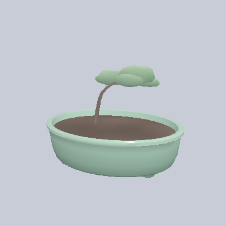 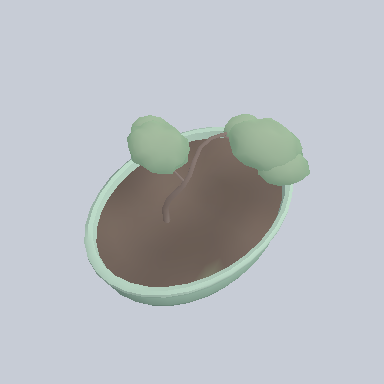 | **Bonsai — 1. aşama (fidan)** `bonsai_stage1` | 2.110 / 6.000 üçgen pastel · 37 × 27 × 27 cm kalite: temiz | ⚪ taslak |
| 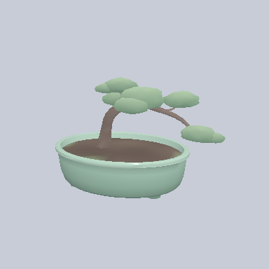 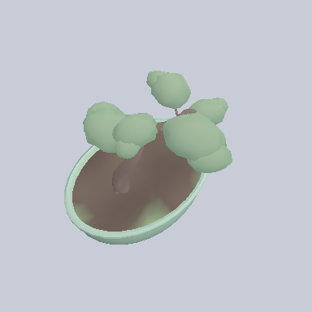 | **Bonsai — 2. aşama (orta)** `bonsai_stage2` | 3.640 / 6.000 üçgen pastel · 45 × 29 × 31 cm kalite: temiz | ⚪ taslak |
| 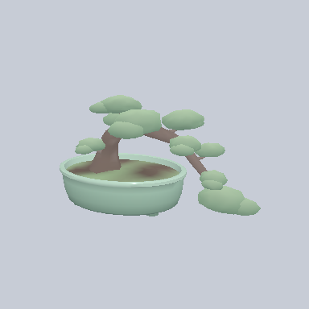 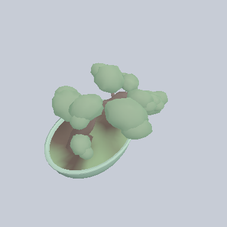 | **Bonsai — 3. aşama (olgun)** `bonsai_stage3` | 5.838 / 6.000 üçgen pastel · 57 × 31 × 35 cm kalite: temiz | ⚪ taslak |

## tomato

Üretici: `blender/specs/tomato.toml`

| Görünüm | Asset | Bilgi | Durum |
|---|---|---|---|
| 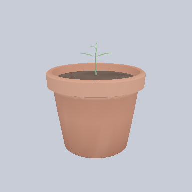 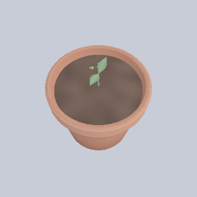 | **Domates — 1. aşama (fide)** `tomato_stage1` | 1.602 / 2.200 üçgen pastel · 22 × 24 × 22 cm kalite: temiz | ⚪ taslak |
| 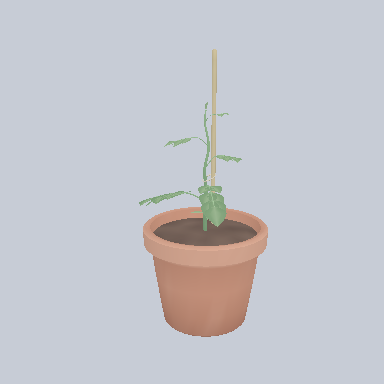 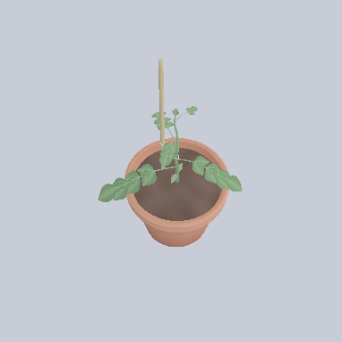 | **Domates — 2. aşama (genç)** `tomato_stage2` | 3.971 / 5.500 üçgen pastel · 27 × 49 × 24 cm kalite: temiz | ⚪ taslak |
| 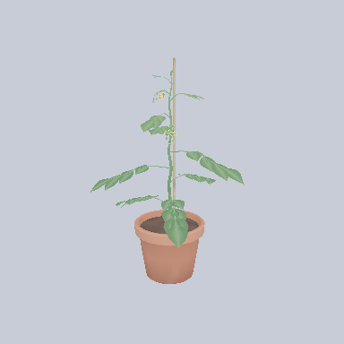 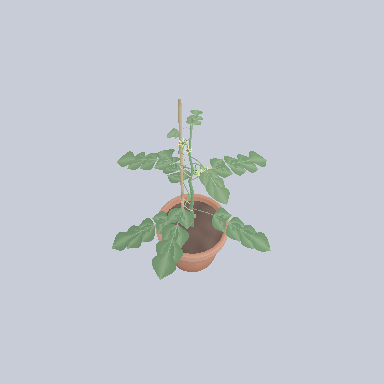 | **Domates — 3. aşama (çiçekli)** `tomato_stage3` | 7.370 / 10.000 üçgen pastel · 47 × 69 × 46 cm kalite: temiz | ⚪ taslak |
| 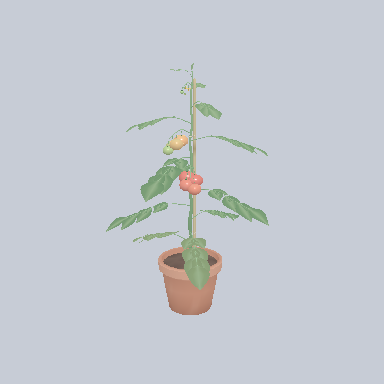 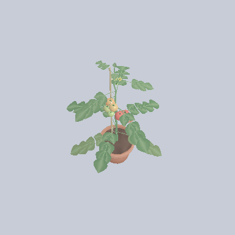 | **Domates — 4. aşama (olgun)** `tomato_stage4` | 11.912 / 13.200 üçgen pastel · 55 × 84 × 55 cm kalite: temiz | ⚪ taslak |

## wooden_crate

Üretici: `blender/specs/wooden_crate.toml`

| Görünüm | Asset | Bilgi | Durum |
|---|---|---|---|
| 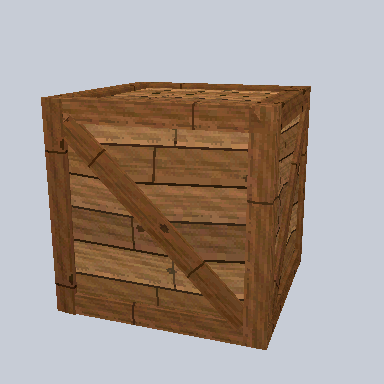 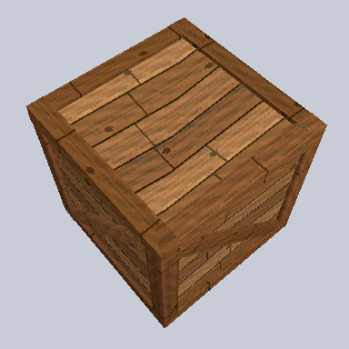 | **Ahşap sandık** `wooden_crate` | 204 / 500 üçgen ps1 · 80 × 80 × 80 cm kalite: temiz | ⚪ taslak |
